# Riemann

It's just a spare-time project of my own, consisting of full/partial implementations of some papers in geometry processing, or whatever is amazing.

## Log

[2025-04-26] Spent the whole afternoon recompiling this old code from my PhD days... Finally made it through! :sunglasses: :tada:

[2015-04-15] Implement LSCM/DCP, see [[Mullen et al. 2008]](https://hal.inria.fr/inria-00334477/document).

[2014-04-18] Implement calculating Green Coordinates in 2D for points inside cage, and slight modification of GC for exterior and boundary points will be included in future, as well as Green Coordinates in 3D.

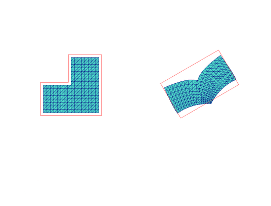

[2015-04-20] Finish Green Coordinates in 3D and up till now [[Lipman et al. 2008]](http://citeseerx.ist.psu.edu/viewdoc/download?doi=10.1.1.150.2116&rep=rep1&type=pdf) is partially reproducted. The computation for GC  of exterior points of cage may be  included in future, which allows for controlling deformation using a partial cage.

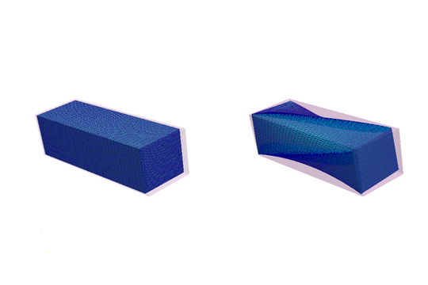

[2015-05-22] Partially implement [[Funck et al. 2006]](https://isgwww.cs.uni-magdeburg.de/visual/files/publications/Archive/Funck_2006_SIGGRAPH.pdf). More modeling metaphors may be included in future.

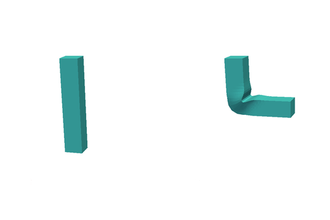

[2015-05-27] Implement twisting and bending effects based on vector field.

[2015-06-13] Implement frame-driven deformation proposed by [[Panozzo et al. 2014]](http://igl.ethz.ch/projects/frame-fields/frame-fields.pdf). The other part about frame-field aligned quadrangulation may included later, which consistis of processes to paramterize and remesh the deformed surface for obtaining a uniform quadrilateral mesh.

[2015-06-25] Implement deformation transfer for triangle meshes [[Sumner et al. 2004]](http://people.csail.mit.edu/sumner/research/deftransfer/Sumner2004DTF.pdf), which uses gradient based deformation method.

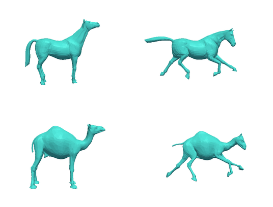

[2015-07-01] Implement another method for solving triangle correspondence guided by harmonic fields in deformation transfer, which is proposed by [[Zayer et al. 2005]](http://citeseerx.ist.psu.edu/viewdoc/download?doi=10.1.1.226.1150&rep=rep1&type=pdf).

[2015-08-27] Implement construction of standing wave on surface proposed by [[Zhang et al. 2010]](http://www.cad.zju.edu.cn/home/hj/10/Huang10WaveQuad.pdf).

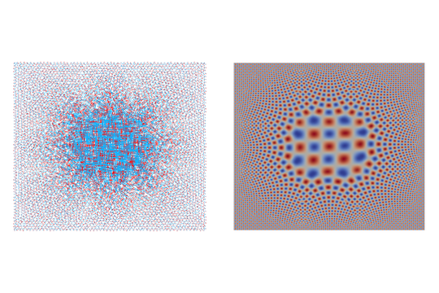

[2015-12-01] Implement a 3D bounded distortion solver according to [[Kovalsky et al. 2015]](http://www.wisdom.weizmann.ac.il/~ylipman/2015_LargeScaleBD.pdf).

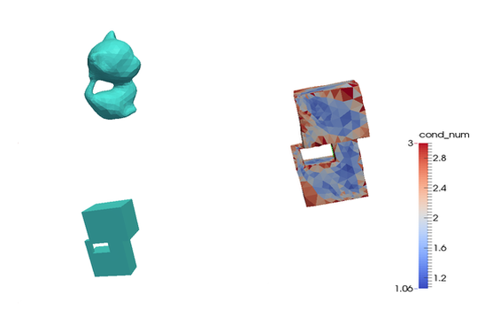

[2016-01-03] Implement spin transformations without considering boundary conditions [[Crane et al. 2011]](http://www.cs.columbia.edu/~keenan/Projects/SpinTransformations/paper.pdf).

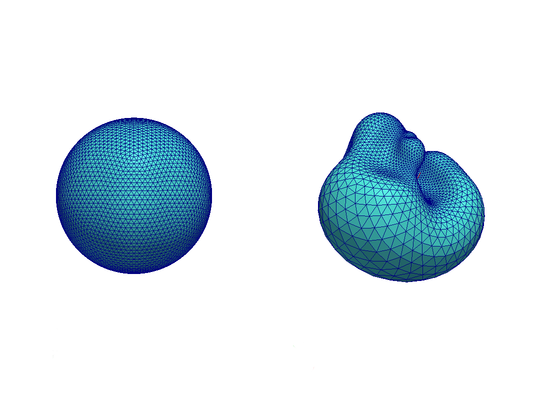

[2016-02-18] Implement ARAP parameterization [[Liu et al. 2008]](http://www.cs.harvard.edu/~sjg/papers/arap.pdf).

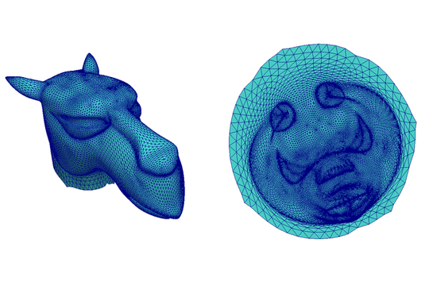

[2016-03-29] Implement close-to-conformal deformations of volumes with charges as the conformal factor design tools [[Chern et al. 2015]](http://dl.acm.org/citation.cfm?id=2766916).

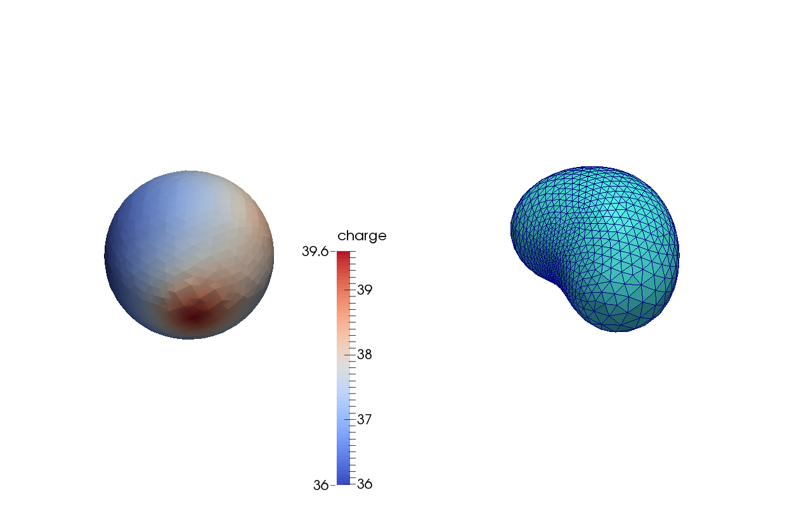

[2016-07-14] Implement spherical harmonics based 3D cross frame field generation [[Huang et al. 2011]](http://www.cad.zju.edu.cn/home/hj/11/3D-cross-frame.pdf). Try `run_volume_frame.sh` for some examples.

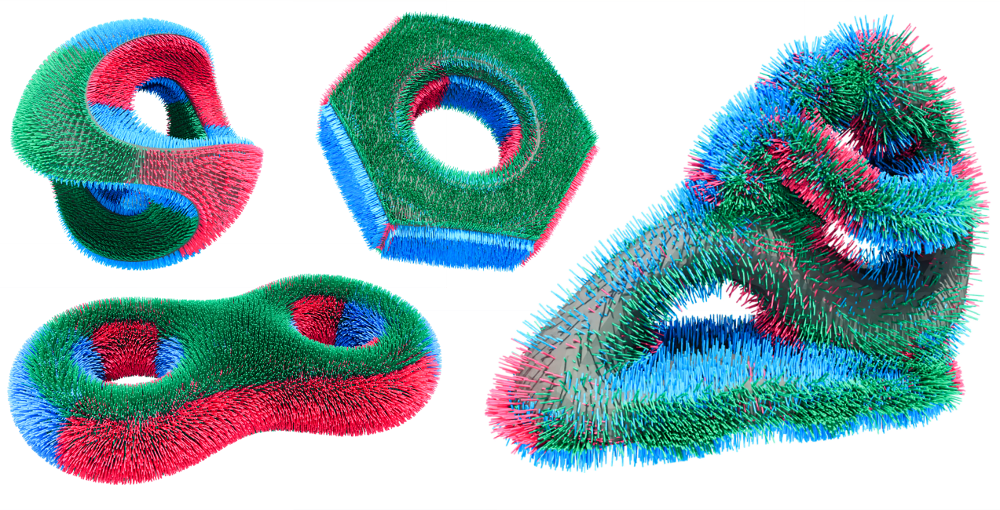

[2016-08-08] Implement the core parts of L1 polycube [[Huang et al. 2014]](http://www.cad.zju.edu.cn/home/hj/14/l1-poly/l1-poly.pdf).

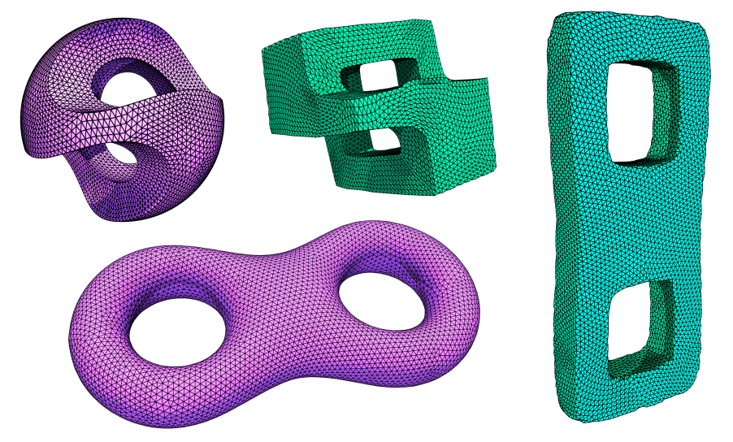
